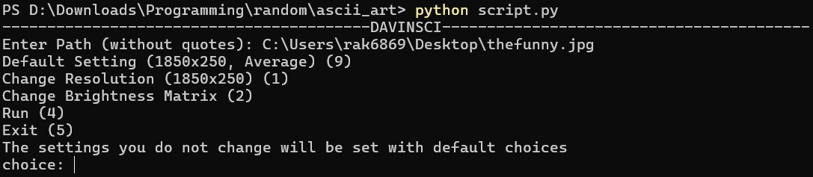

# Davinsci

**davinsci** is a Python script that converts images into ASCII art. It resizes the image and generates a text-based representation using a set of predefined characters.

## How to Use

To use **Davinsci**, you need to have Python installed along with the Pillow library. 

## Usage

Run the script from the terminal. Follow the menu

## Acknowledgments

The idea for this project came from a Reddit [post](https://www.reddit.com/r/learnprogramming/comments/g9zp9i/where_can_i_find_ideas_or_projects_to_work_on/) by u/knowledgeunlimited, where u/hditano commented with a bunch of links, of which one led me to this [article](https://robertheaton.com/2018/06/12/programming-projects-for-advanced-beginners-ascii-art/) by Robert Heaton 

## beautiful ascii art
Art by Sri Sehshagiri KM

